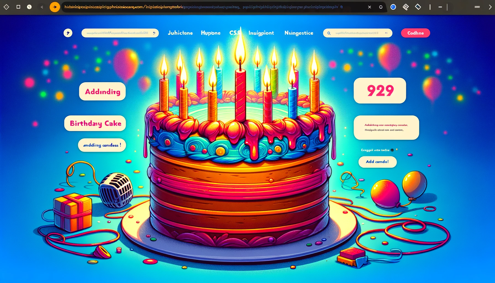

# 🎂 Interactive Birthday Cake Project 🎉

## Overview

This Interactive Birthday Cake 🎂 project is a delightful web-based application. Users can interactively add candles 🕯️ to a birthday cake and blow them out using their microphone, combining HTML, CSS, and JavaScript for a charming user experience.

## Author

Created by **Ilavanya Jain**

## Features

- **Interactive Cake**: Click to add candles 🕯️.
- **Microphone Integration**: Blow into your mic to extinguish candles 🎤.
- **Candle Count**: Watch the candle count change dynamically 🔢.
- **Engaging UI**: Engage with a user-friendly interface.

## How to Use

1. Open the project in your browser.
2. Allow microphone access.
3. Click on the cake to add candles.
4. Blow into your device to blow out the candles.

## Technologies

- HTML
- CSS
- JavaScript

## License

This project is released under the [MIT License](LICENSE).
